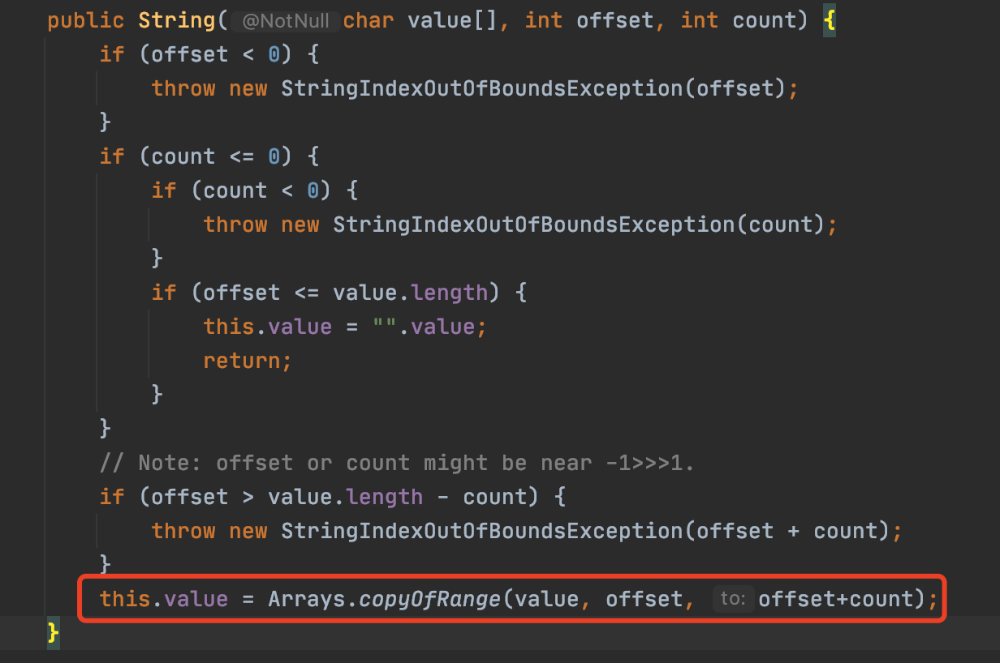

Java String（JDK6）引发内存泄露的实例和Split方法使用（避免回溯问题）

[JDK6-String引发的内存泄露实例链接](https://blog.csdn.net/yue_chen1983/article/details/84159123)
**操作步骤**
1.启动备用服务器，将流量引流至新服务器
2.在问题服务器上，把java应用程序使用heap dump导出成文件；
执行jmap -dump:format=b,file=heap.bin <pid>
3.使用java heap分析工具，分析heap.bin文件，找出内存占用超出预期（一般是因为数量太多）的嫌疑对象
4.必要时，需要分析嫌疑对象和其它对象的引用关系
5.查看程序的源码，找出嫌疑对象数量过多的原因
**原因分析**
JDK6下，substring方法返回的新对象是调用String(int  offset,  int  count,  char  value[]) 这个构造方法，这个方法会复用原String对象的value（即char[]数组），因为原String对象很大，所以经过substring方法拆分后的新对象依旧很大，造成内存占用过多。

JDK8环境，核对了String的String(int  offset,  int  count,  char  value[])构造方法，如图：

value按需截取，不会复用原对象value。
* * *
* * *
首先明确回溯问题是由于正则表达式引发的，可能会造成CPU飙升100%，最终影响正常服务。
[正则表达式 贪婪、勉强、独占模式链接](https://blog.csdn.net/weixin_44259720/article/details/88554218?utm_medium=distribute.pc_relevant.none-task-blog-BlogCommendFromMachineLearnPai2-1.edu_weight&depth_1-utm_source=distribute.pc_relevant.none-task-blog-BlogCommendFromMachineLearnPai2-1.edu_weight)
[一篇解决参考链接](https://cloud.tencent.com/developer/article/1589098)
JDK8 String的split方法，若参数为简单的字符串（不含正则表达式）则使用indexOf方法遍历，若不是简单字符串则会使用正则表达式解决，可能会引发回溯造成CPU飙升。